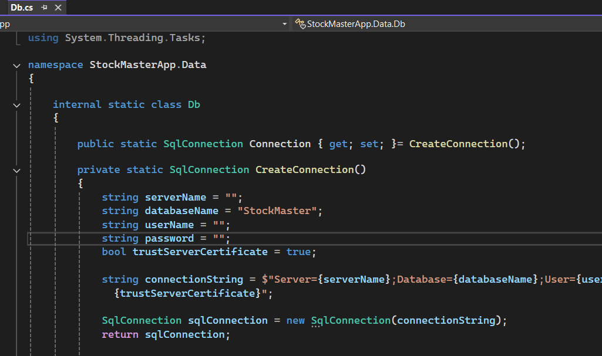
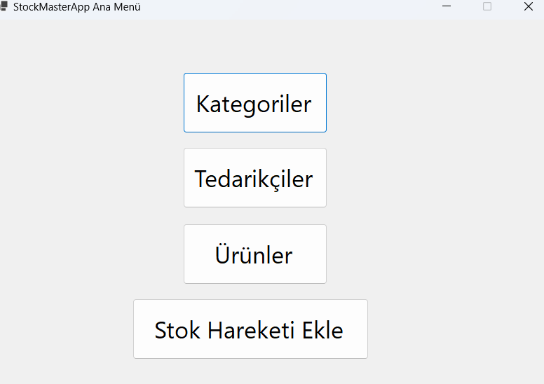
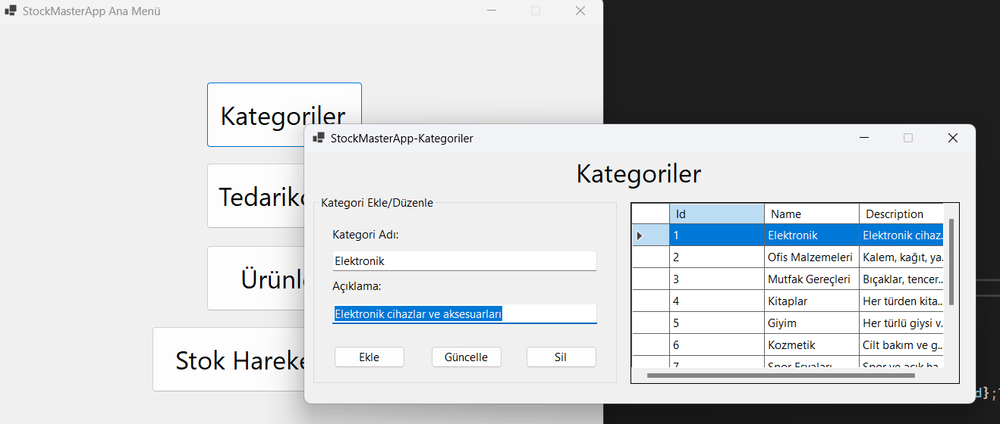
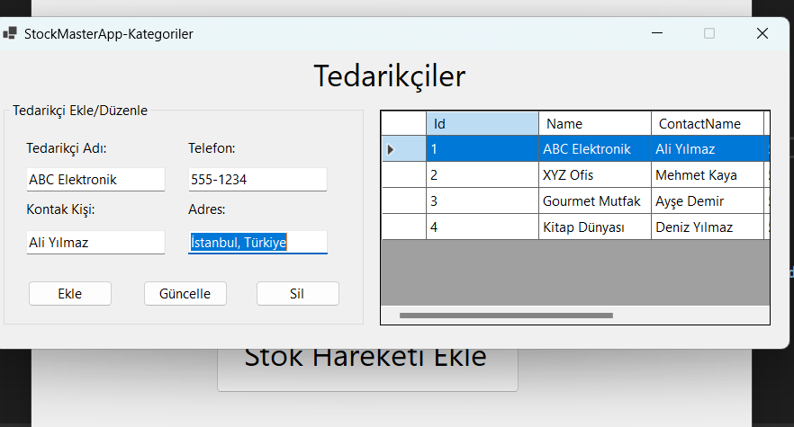
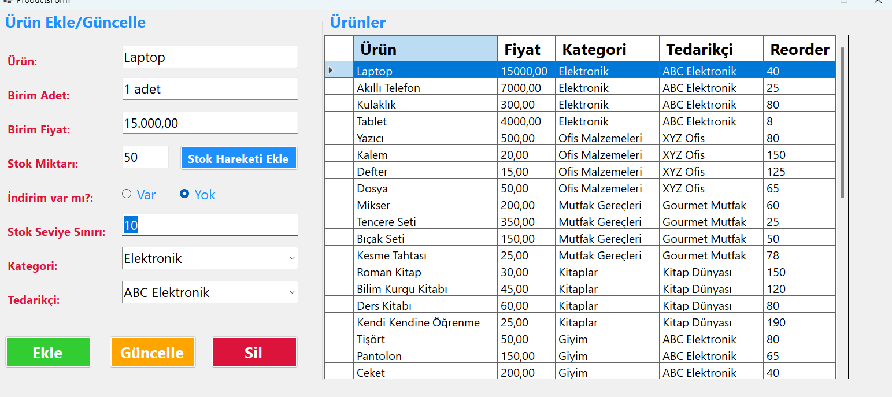
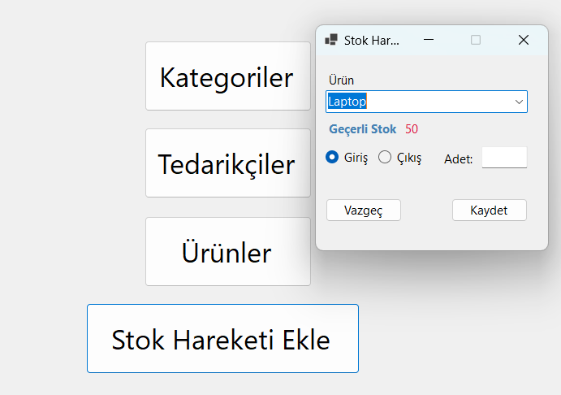

# StockMaster
 
 SQL kodları dosyada mecvut olan stok takip programımın detaylarını görselleriyle birlikte inceleyebilirsiniz;

 NOT: Proje dosyasında yer alan Db.cs sayfasında ki veritabanı bilgilerini kendi bilgilerinizle güncellemeyi unutmayın

 

 # Ana menü ekranı

Ana menü ekranı 4'e ayrılmaktadır

 

# Kategoriler

Kategorilere yeni bir kategori ekleyebilir, güncelleyebilir veya kategoriyi silebilirsiniz.

# Tedarikçiler

Tedarikçi bilgilerinin yer aldığı bu kısımda yeni bir tedarikçi ekleyebilir silebilir güncelleyebilirsiniz.

# Ürünler

> Ürünler kısmında seçili olan ürünlerin bilgisi getirilir.
Ürünün bilgileri gösterilir
Yeni ürün eklenebilir
Ürün güncellemesi yapılır
Ürün silme işlemi yapılır
Seçili ürünün stok bilgilerine erişebilir açılan sayfada işlem yapılabilir

# Stok Hareketleri Ekle
